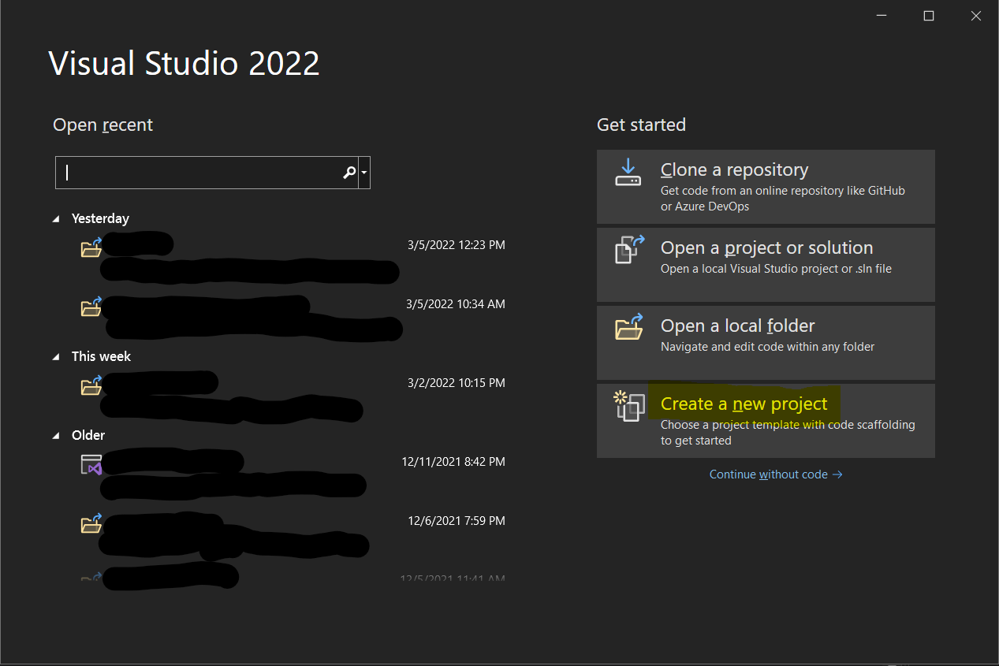
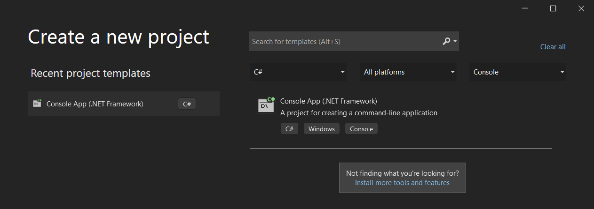

If you have not already, please follow the [instructions to get started with C#](/csharp/).  As stated on that link, 
I **highly** recommend getting Visual Studio.  It's totally free, and if you end up working in C#, it is likely what your
employer will use, so this let's you "practice how you'll play."

Once you're set up, let's get right to it with the classic starter program: **Hello World!**

## End Result
A simple console application that spits out the message "Hello, World!" along with anything else we
decide to make it say!

## Visual Studio: Getting Started
*__NOTE__: If you decided to code in your browser or some other program, you can ignore these Visual Studio-specific setup instructions.*

When you first open Visual Studio, you'll see a list of recently opened projects (yours will probably be blank) and options
to create new projects.  If you hadn't already guessed, you'll want to click "Create New Project":



Depending on what you picked during the installation, the next screen may show you a ton of different project types.  The
one you are looking for is called *Console App (.NET Framework)* and should have a C# file icon next to it.  You can use
the dropdowns at the top of the window to narrow things down to just C# and Console in order to find it really quickly.



If you don't see that option at all, you may need to open up the Visual Studio Installer and be sure to select ".NET desktop development"
as the package you want installed.

Once you select your project type, give it a name (e.g.: HelloWorld) and select where it will be saved.  The solution name 
will automatically change to match the project name - don't worry about what a "solution" vs a "project" means right now.  For
the framework at the bottom, just go with the default that was selected.  For the record, mine was created using .NET Frameowrk 4.7.2.

## A Tour of the New Visual Studio Project

After your project is created, you'll see what Visual Studio looks like.  On one side, you'll see a list of files that were 
created for your project, and at the bottom you should see a window for console output or an error list.  Don't worry about any 
of that for now - we'll cover those when we need to.  For now, you only need to worry about one file: `Program.cs`.  It should have
opened automatically and be sitting in front of you.  You should see something like this:

```csharp
using System;
using System.Collections.Generic;
using System.Linq;
using System.Text;
using System.Threading.Tasks;

namespace HelloWorld
{
    internal class Program
    {
        static void Main(string[] args)
        {
        }
    }
}
```

Before we write any additional code, let's take a look at what Visual Studio did for us.

```csharp
using System;
using System.Collections.Generic;
using System.Linq;
using System.Text;
using System.Threading.Tasks;
```

These lines import various packages of code - don't worry too much about what that means.  You may notice that they are all sort of greyed out - that's because
our code isn't actually using any of them.  Visual Studio just prepopulates the top of the file with common packages.
Having extra is totally harmless, so leave these alone.

```csharp
namespace HelloWorld
```

A namespace is a way to group various pieces of code.  If we exported our code into a package - again, don't worry too much about all that - this namespace would be
what *other* code would put at the top, e.g.: `using HelloWorld;`.  We're working with literally 1 file, so this also doesn't matter much right now.

```csharp
    internal class Program
```

In C#, each file typically represents one class.  The Program.cs contains the `Program` class.  Once again, don't worry about what a "class" is.  We'll get to that
later, in projects where we use several files that have to reference each other.

```csharp
        static void Main(string[] args)
        {
        }
```

## Understanding Program Flow
Back in the day, programs were really simple.  The computer would start at the top of the file and run the first line, then the second, and so on until it hit the end
of the file.  These days, code can sprawl across many files and be a tangled mess of references between those files.  Thus, every program needs an "entry point" so the
computer knows where to start, since it can't just go to line 1 of a single file.  `Main` is that entry point.  Think of it as the front door of your program.  Once you're
in the door, you can travel to other parts of the code, but you have to start by going through the front.  Wondering what all the `args` mess is about?
You guessed it: don't worry about it, we'll get to that later. 😬

All you need to know is that *your* code will go between those curly braces.  Like code back in the day, the computer will still start at the top of `Main` and go line by 
line until it gets to the bottom.  Those curly braces are the boundaries for `Main`, so the computer knows where to start and stop once it enters the front door.

**Be aware**: If you delete any of the curly braces, you're going to confuse your computer.  Without these guidelines to let it know where things start and end, it will get *really*
confused.  In fact, try deleting one right now.  Give Visual Studio a second to process what you've done, and you'll see squiggly red lines appear under some of the code - just
like you would if you misspelled something in a Word document.  The problem you created is at the line where you deleted a bracket, but notice where the red squiggly lines went.

If you deleted the first bracket `{`, you'll see red lines under `Main`.  Hover your mouse over `Main` and Visual Studio will pop up the reason for the red lines.  It
tells you `Main` has to "declare a body" - in other words, it sees the front door, but it can't tell what room that door is connected to because you bulldozed one of the walls.  What
about if you delete the second bracket `}`?  Now there is a red squiggly at the *very end*.  Visual Studio sees 3 opening brackets, but only 2 closing brackets.  Again, you
bulldozed one of the walls of this structure and now Visual Studio says "wait... there's supposed to be a wall here!"

So this leads to my **BIG FAT WARNING**: Be very careful if you select a bunch of code and delete it.  When you inadvertently delete a curly brace, you're going to wind up with red
squiggly lines *way far away* from where you've created a problem.  I've seen plenty of beginners hunting their code for way too long only to find out that they deleted a chunk of code
and left an extra curly brace or accidentally deleted one by accident.

## Writing Your First Code

If you haven't yet, put your curly braces back below `Main`.  Put your cursor between them, hit your Enter key to get a new line, and write your **very first line of code**:

```csharp
static void Main(string[] args)
{
    Console.WriteLine("Hello, World!");
}
```

Hooray!  You did it!  You wrote your first code! 🎉🎉

*But what does it do?*

Good question!  Let's find out.  At the top, you should see a button with a green triangle - just like on a music player - that will have your project name (like "HelloWorld")
next to it.  Click that (or for you shortcut-lovers, hit F5 on your keyboard) and see what happens.

Let me guess: Visual Studio looked like it was busy, then a command prompt popped up and immediately disappeared, but you could *almost* see the words "Hello, World!" in there before
it closed?  Congratulations - that's exactly what's supposed to happen.

**NOTE:** If your command prompt window stayed open, that's cool.  Some editors will automatically do what we're about to add to the code ourselves below.
It's also possible that you picked a newer version of the .NET Framework when you were making your project - no worries, everything will still work just the same.

## Improving Your Code

You'd probably like to see the message before the console closes, right?  Right now, we're telling the `Console` to write a line of text.  Your computer reads the next line, see it's
the end of the block of code for `Main`, and it says "looks like we're done here" and closes the program.  What we need to do is tell it to do something that will make it wait for us
to read the message.  Below your `WriteLine` code, you're going to tell the computer to `ReadLine` as well, like so (I left out the brackets and `Main` just to save space):

```csharp
Console.WriteLine("Hello, World!");
Console.ReadLine();
```

**SIDE-NOTE**: By now, you may have noticed Visual Studio suggesting things as you type.  This automatic completion is one of the colest parts of a full-fledged code editor like Visual 
Studio.  If you like what Visual Studio is suggesting, you can hit Tab to automatically complete.  If it isn't popping up suggestions and you want it to, hit Ctrl+Space - it will either 
finish what you're typing (if there's only one possible correct thing) or pop up a list of suggestions.  *Pretty cool, right?*

If you haven't yet, hit F5 and run your code again.  You'll notice the message sticks around until you hit the Enter key on your keyboard.  There's just one problem:
*It doesn't tell you to hit Enter*.  Any ideas how to fix it?  If you wondered "can I put another `WriteLine` command in there?" then you hit the nail on the head.  Let's do that:

```csharp
Console.WriteLine("Hello, World!");
Console.WriteLine("Press any key to continue...");
Console.ReadLine();
```

Run it again, see what happens.  Did you try hitting *any* key?  Turns out, my message isn't exactly right.  I could change that line to say "Press Enter to continue", but I want users
to be able to hit *any* key.  Let's try something: get rid of the `ReadLine()` part and leave just `Console.` and see what Visual Studio suggests.  As a reminder, if it doesn't pop up 
suggestions already, hit ctrl+space to make it.  As you type, it will filter down to things that match.  If `ReadLine` isn't write, is there something else we can "read" from the user
that will let them hit any key?  Here's what I came up with:

```csharp
Console.WriteLine("Hello, World!");
Console.WriteLine("Press any key to continue...");
Console.ReadKey();
```

Hit F5, do a test run, annnnnd... **BOOM!**  It works!  Time to celebrate - we just made our first program! 🍾

## What's Next?

We'll pick back up with Hello World next time and use it to learn some more programming concepts.  For now, I encourage you to ***experiment!***  In fact, any time you're following along you should feel free to try things out that come to mind.  In general, there is not much harm you can do by changing things.  If these tutorials ever venture into territory where you need to be very careful, *I will heavily warn you*.  So give it a shot and try some things out!  For example:

- Add more `WriteLine` commands to see what else works
  - Are those quotes really necessary?
  - Will numbers work?
- See what other commands are available when you type `Console.`  *Eventually we'll explore this, but see if you can figure some of it out yourself!*
- Whatever else you can think of!  **Have fun with it!!**

Well folks, that concludes this lesson.  Pat yourself on the back, because:
> **We made a program**! 😁

Next up: [Hello World Part 2](/hello-world-csharp-2/).